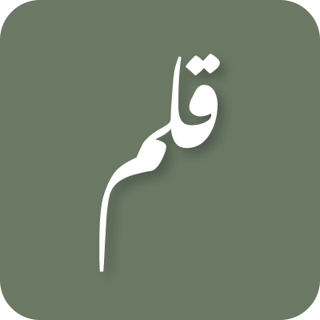

<div align="center">
  
  <h1>qalam playground</h1>
  <p>A web-based playground for experimenting with and running Qalam code, powered by Rust and React.</p>
  <a href="https://qalam-playground.web.app">Check it out</a>
</div>

## Introduction
[Qalam](https://github.com/ammar-ahmed22/qalam) is a custom programming language inspired by Urdu terminology. This web-based playground lets you edit and execute Qalam code in your browser with a Rust-powered backend and a React/TypeScript frontend.

For more information about Qalam, see the repo [here](https://github.com/ammar-ahmed22/qalam).

## Features
- **Code Editing**: Use a responsive code editor with syntax highlighting tailored for Qalam.
- **Run Code**: Compile and run Qalam code in real time, with feedback and results displayed instantly.
- **Rust Backend**: The Qalam interpreter is powered by a Rust-based backend for fast, efficient code execution.
- **Web Interface**: A user-friendly React and TypeScript frontend for a seamless experience.

## Running locally
### Clone the repository:
```bash
git clone https://github.com/ammar-ahmed22/qalam-playground
```

### Start the server
1. Navigate to the `server` directory:
```bash
cd server
```
2. Run the server
```bash
cargo run
```

### Start the client
1. Navigate to the `client` directory
```bash
cd client
```

2. Run the client
```bash
npm run start
```
or
```bash
yarn start
```


